# Fleamarket
2018년 서울시 앱 공모전 출품작(뚝섬나눔장터)

1. 클라이언트 = android(java), firebase-cloud-messaing(서버 연동), alarmmanager, MVVM패턴 
2. 서버 = django, mongodb, fcm연동 
3. 사용 라이브러리 = glide, retrofit, lombok 

기능 - 공통
* 로그인, 로그아웃, 회원가입

기능 - 일반 바자회 이용자
* 위치별 상품 검색
* 카테고리별 상품 검색
* 공지사항 보기( 공지 파일 다운로드)

기능 - 판매자
* 신청서 작성
* 상품 등록, 삭제

기능 - 관리자
* 판매 신청서 승인(랜덤, 선착순, 개인 지정)
* 승인 당첨 판매자들에게 메시지 전송

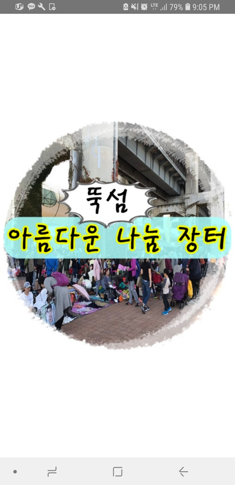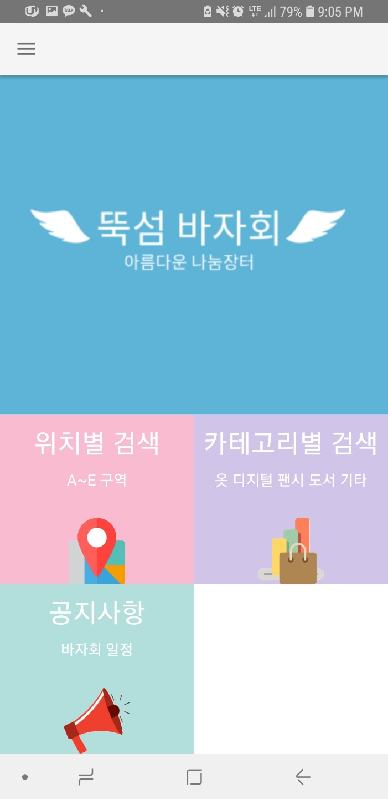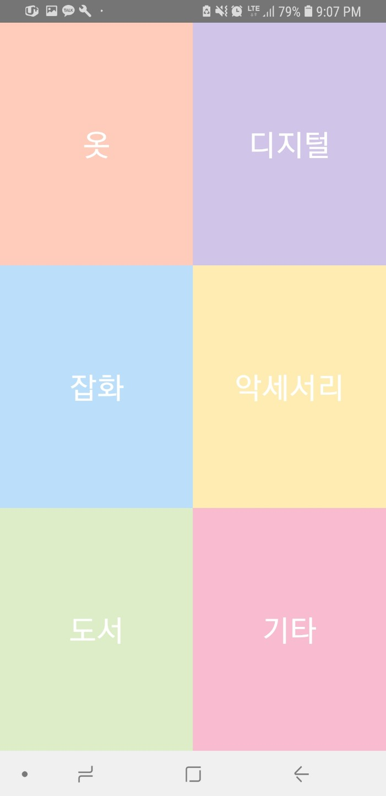
   
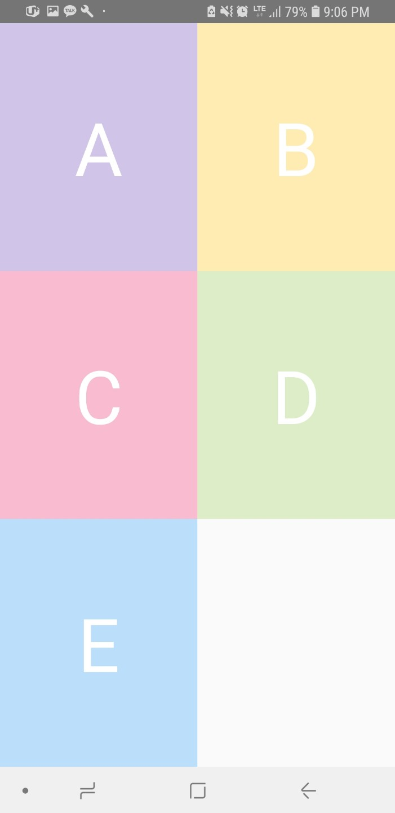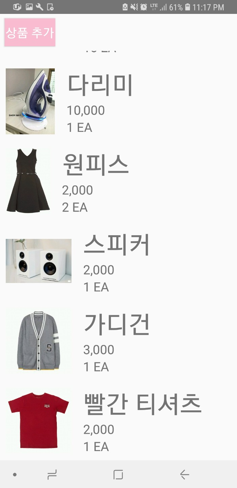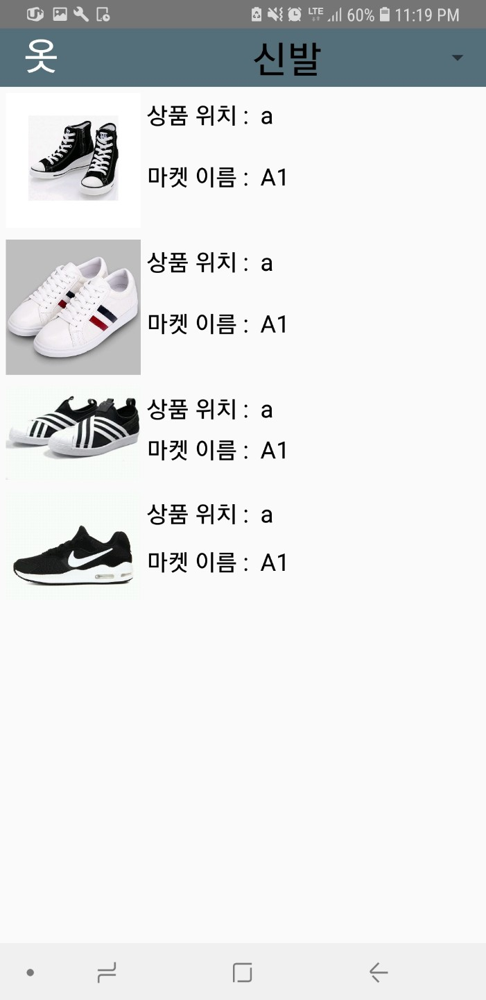
   
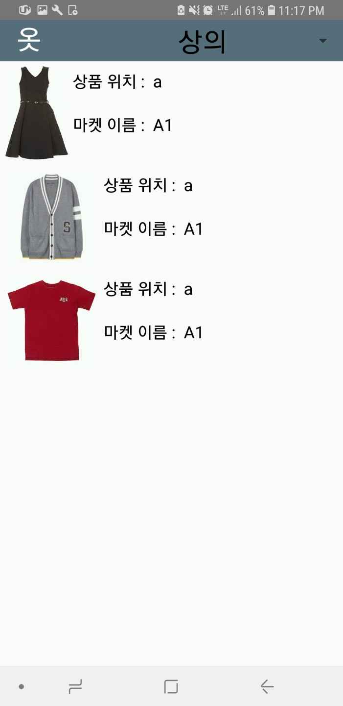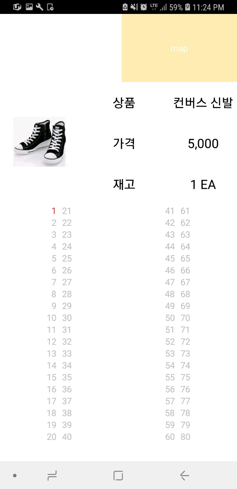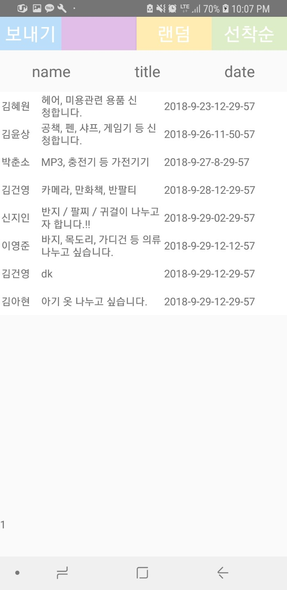
   
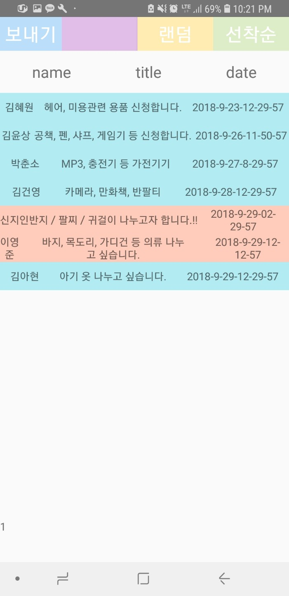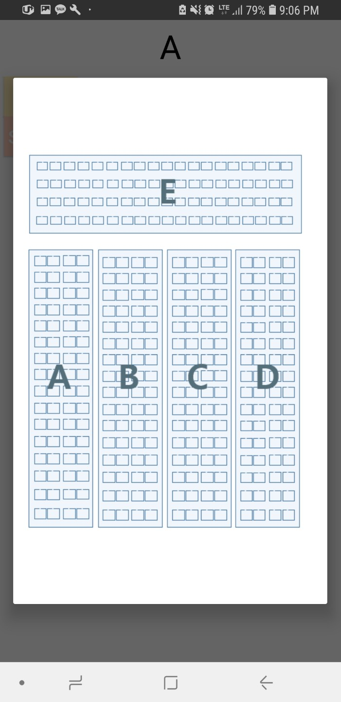
   
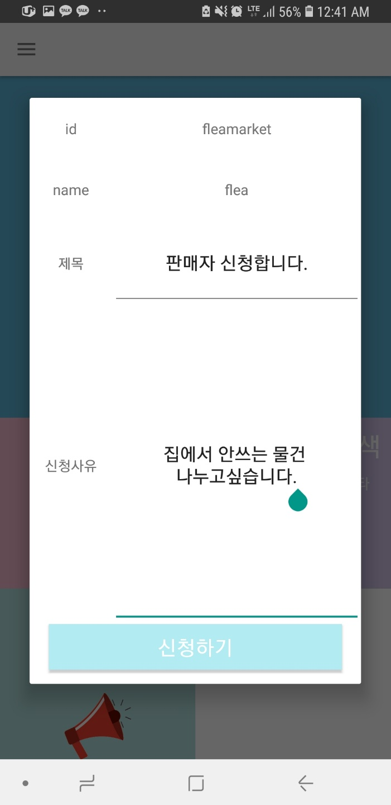
